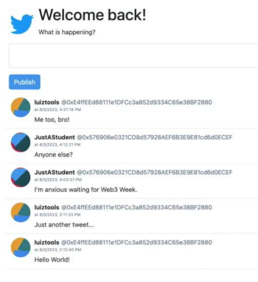

# web3-w3w-criptwitter
A non-commercial microblog decentralized application using the popular MetaMask browser extension to access a Ethereum blockchain developed during 
W3W Workshop under supervision of Prof. Luiz Duarte Jr. (@luiztools). 

## Workshop Web3 Week


```
Disclaimer:

Apresento abaixo minhas anotações pessoais das aulas do evento Web3 Week produzido e apresentado pelo
Professor Luiz Duarte Jr do Canal LuizTools.

Por se tratar de um primeiro contato com a tecnologia denominada Web3, podem haver erros nas minhas observações
e conclusões sobre os tópicos abordados. 
```

## **Aula 1**

Nessa aula foram passados conceitos importantes sobre Web3, blockchain, Solidity language etc. Também foi apresentado o projeto a ser desenvolvido
durante o evento, que trata-se de um microblog para troca de mensagens em uma rede blockchain.

Foram apresentadas diversas tecnologias necessárias e atuais como se segue:

### **Tecnologias**

- Solidity para o Smart Contract
- ReactJS com Next no Frontend
- Bootstrap e JavaScript
- Integração carteira MetaMask

## **Nivelamento**
```
Os tópicos dessa seção foram obtidos pelo chatGPT na versão 3.5
```

### Web3

A Web3 é uma visão e um conceito que se baseia na evolução da Internet, buscando criar uma Internet descentralizada e mais orientada para o usuário. Enquanto a Web1 foi a primeira geração da Internet, focada principalmente em conteúdo estático, e a Web2 trouxe interatividade e redes sociais, a Web3 se concentra na descentralização, na propriedade dos dados pelos usuários e na interoperabilidade de aplicativos e plataformas.

A Web3 utiliza tecnologias como blockchain e contratos inteligentes (smart contracts) para alcançar seus objetivos. A blockchain, que é a base da maioria das criptomoedas, é uma tecnologia que permite um registro distribuído e imutável de transações. Isso torna possível criar sistemas confiáveis sem a necessidade de intermediários centralizados.

Os contratos inteligentes são programas autônomos que executam automaticamente ações quando certas condições são atendidas. Eles possibilitam a automação de processos e a criação de aplicativos descentralizados (DApps) que funcionam sem a necessidade de uma autoridade central.

Na Web3, os usuários têm maior controle sobre seus dados pessoais e digitais. Eles podem possuir, controlar e monetizar seus dados de maneira mais direta. Isso contrasta com a Web2, onde muitas vezes os dados dos usuários são coletados e utilizados por grandes empresas de tecnologia.

No geral, a Web3 busca empoderar os usuários e criar um ambiente digital mais aberto, transparente e descentralizado, onde as pessoas possam participar ativamente, compartilhar informações com mais segurança e controlar sua presença online de forma mais significativa.

### Blockchain

No contexto da Web3, o blockchain é uma tecnologia fundamental que desempenha um papel crucial na criação de uma internet mais descentralizada e confiável. O blockchain é uma espécie de livro de registro digital distribuído e imutável, onde as transações são registradas de forma sequencial e transparente.

Em vez de ter um único servidor central que controla os dados e as transações, o blockchain é mantido por uma rede de participantes (nós) que validam e registram novas transações. Cada transação é agrupada em um bloco, e esses blocos são encadeados de maneira cronológica, formando a "cadeia de blocos" (blockchain).

Aqui estão alguns pontos-chave sobre o blockchain no contexto da Web3:

**Descentralização**: O blockchain é descentralizado, o que significa que não é controlado por uma única entidade. Isso reduz a dependência de intermediários e autoridades centrais, tornando a rede mais resistente a falhas e censura.

**Imutabilidade**: Uma vez que uma transação é registrada no blockchain, ela não pode ser alterada ou apagada. Isso proporciona um alto nível de segurança e confiabilidade às informações armazenadas no blockchain.

**Segurança**: A criptografia é usada para proteger os dados no blockchain, tornando extremamente difícil para qualquer pessoa adulterar as informações ou invadir o sistema.

**Transparência**: Todas as transações registradas no blockchain são visíveis para todos os participantes da rede. Isso aumenta a transparência e a confiança, pois qualquer um pode verificar a validade das transações.

**Contratos Inteligentes**: Além de armazenar transações, muitas blockchains permitem a criação e execução de contratos inteligentes. Esses são programas autônomos que podem automatizar a execução de acordos pré-definidos quando as condições especificadas são cumpridas.

**Propriedade e Controle dos Dados**: No contexto da Web3, o blockchain permite que os usuários tenham maior controle sobre seus próprios dados, já que podem armazená-los e compartilhá-los com segurança sem depender de intermediários centralizados.

No geral, o blockchain é uma tecnologia essencial para a construção de aplicativos e plataformas na Web3, pois oferece uma infraestrutura que suporta a descentralização, a segurança dos dados e a execução confiável de transações e contratos.

### **Projeto**

**Projeto - Telas da aplicação**

A aplicação será um microblog denominado *CrypTwitter* e terá:

- uma tela de entrada com um botão para se conectar com a carteira MetaMask.


- autenticação.

- acesso ao feed do microblog com possibilidade de publicar sua mensagem.



- recurso de paginação.

- registro e recuperação da blockchain

- integração com carteira

- deploy

 **Projeto - Topologia**


**Backend**

Para programar o backend usaremos a linguagem Solidity (c) através da plataforma online Remix.


[URL do Remix](https://remix.ethereum.org/)

O Remix é o IDE nativo para Desenvolvimento Web3

Etapas da criação do SmartContract


1. A primeira instrução para todo SmartContract é a licença dos códigos fontes:

```
//  SPDX-License-Identifier: MIT
```

2. Definição da versão Solidity usada

```
pragma solidity 0.8.18;
```

3. Definição do contrato

- variáveis globais do contrato
- função para adicionar tweets na storage da blockchain
- criação de uma tabela através da função *mapping*

A função mapping no Solidity é uma estrutura de dados fundamental usada para criar relações de mapeamento chave-valor. Ela é frequentemente usada para armazenar e recuperar informações de forma eficiente em contratos inteligentes na blockchain Ethereum. 

Em essência, um mapping é semelhante a um dicionário ou tabela de hash em outras linguagens de programação. A 'tabela' mapping associa um número inteiro a um hash identificador de um tweet.

Como a unidade lógica 'Tweet' é mais complexa que apenas um texto será necessário criar uma estrutura de dados através da cláusula '*struct*'

Então criou-se primeiro a estrutura Tweet para depois ser usada no mapping.

```
// A struct abaixo foi criada antes de 'contract'

struct Tweet {
    address author;
    string text;
    uint timeStamp;
    string username;
}
```

Dentro de 'contract' usaremos essa estrutura `Tweet` na função mapping():


```
 mapping (uint => Tweet) public tweets;
```

Exemplo de contratc criado até esse ponto:

```
contract CrypTwitter {

    uint public nextId = 0;
    
    uint public constant PAGE_SIZE = 10;

    mapping (uint => Tweet) public tweets;

    function addTweet (string calldata text) {  // function para criar uma coleção de tweets
}
```

### Fazendo Deploy em uma máquina virtual 

Após a correta compilação pode-se fazer o deploy virtual da aplicação na opção DEPLOY & RUN TRANSACTIONS

Selecionamos o ambiente ``Remix VM (Merge)`` que é um ambiente normalmente usado para testes e clicamos no botão [Deploy].


Dentro de 'contract' serão criadas as duas functions que irão adicionar um Tweet na Blockchain e recuperar um array de tweets de uma determinada página. Abaixo segue o código completo:

```
// A primeira instrução para todo SmartContract é a licença dos códigos fontes:
//  SPDX-License-Identifier: MIT

// Definição da versão Solidity usada
pragma solidity 0.8.18;


// Struct de um Tweet

struct Tweet {

    address author;
    string text;
    uint timeStamp;
    string username;
}

// Definição do contrato
contract CrypTwitter {

    uint public nextId = 0;
    
    uint public constant PAGE_SIZE = 10;

    mapping (uint => Tweet) public tweets;

    function addTweet (string calldata text) public {  // function para criar uma coleção de tweets
        Tweet memory newTweet;
        newTweet.text = text;
        newTweet.author = msg.sender;
        newTweet.timeStamp = block.timestamp;

        nextId++;
    
        tweets [nextId] = newTweet;    
    }

    function getLastTweets(uint page) public view returns (Tweet[] memory) {

        // Controle da paginação
        if (page < 1) page = 1;
        uint startIndex = (PAGE_SIZE * (page - 1)) + 1;

        // Preparação do array de Tweets em memória a ser devolvido ao usuário
        Tweet[] memory lastTweets = new Tweet[](PAGE_SIZE);

        // Laço para pegar cada Tweet e guardar no array Tweet[]
        for (uint i=0; i < PAGE_SIZE; i++) {
            lastTweets[i] = tweets [startIndex + i] ;    // tweets é o mapping de Tweets 
        }
        return lastTweets;   
    }
}
```

## **AULA 02**

Para funcionamento do nosso dAPP o `smart contract` deve estar carregado em alguma blockchain pública para que se possa salvar e recuperar dados.

Nessa aula aprenderemos como funciona uma blockchain real migrando nosso `smart contract` do ambiente virtual `Remix` para um ambiente de teste real numa blockchain denominada `BscScan` da blockchain `Binance`.

Na sequência, iniciaremos nosso projeto Front End.


### Objetivos

1. Criar uma carteira de criptomoedas
2. Colocar fundos de teste 
3. Fazer deploy do nosso contrato na blockchain de teste
4. Testar seu funcionamento
5. Iniciar a configuração do Front End

### Introdução

As operações de escrita numa block chain tem custos.

Para fazer essa operação vamos usar um software de carteira, que é um tipo de software que realiza pagamentos na blockchain. 

Esse software será o `MetaMask`.

`Metamask` é uma extensão para navegadores e uma carteira digital que permite aos usuários interagir com aplicativos descentralizados (DApps) baseados na tecnologia blockchain, como os construídos na rede Ethereum. 

Ela atua como uma ponte entre o navegador do usuário e a rede blockchain, facilitando a interação com aplicativos que utilizam contratos inteligentes e tokens criptográficos.

A [MetaMask](https://metamask.io) é o software de carteira cripto mais popular atualmente.


No entanto para usar uma carteira MetaMask é necessário colocar fundos.

Para esse treinamento foi utilizada uma blockchain de teste denominada **`BscScan`**. Que é a blockchain da `Binance`. 

Por padrão a `MetaMask` está configurada para a `Ethereum` de produção. Para não gastar iremos acessar:

[https://testnet.bscscan.com](https://testnet.bscscan.com)

que é o site da blocchain de teste da `Binance`


Desça até o final da página e clique em Add BSC Mask


Cada blockchain tem sua moeda nativa.

Na rede `Ethereum` é ETH.

Na rede BscScan é TBNB

Para colocar saldo de teste iremos até sites denominados **faucet** e colocaremos um fundo:

[Binance Faucet](https://testnet.bnbchain.org/faucet-smart)


Após responder o capcha indique sua conta de teste da Bscscan e você receberá 0.1 TBNB de teste.

Esse TBNB não tem valor fiduciário, mas pode ser usado para fazer a simulação real de um deploy do smart contract numa blockchain (no caso uma de teste).

Agora é possível carregar o contrato da CripTwitter para a blockchain de teste. 

Para isso ao entrar na aba Environment da tela de DEPLOY & RUN TRANSACTIONS escolheremos a opção:

*Injected Provider - MetaMask*


Após clicar em [Deploy] a extesão MetaMAsk será acionada mostrando um resumo da transação e pedindo confirmação.

Informando o número do seu contrato na tela da BscScan você pode ver e auditar um resumo dessa transação:


### **Frontend**

 Iremos usar para construir o nosso Dapp (aplicação descentralizada) o `ReactJs` através do framework `NextJS`.

É importante lembrar que para usar o NextJs é necessário ter o NodeJS instalado.

Para criar o projeto use o comando:

```
npx create-next-app daap-ct
```
onde dapp-ct é o nome da aplicação (ct de criptwitter)

Para IDE de programação do framework usaremos o `VS Code`.

Para estilização da página usaremos o `Bootstrap`

### Criação da página inicial


### Comunicação da DAPP com a carteira MetaMask

Para fazer a integração entre o APP e uma carteira cripto vamos importar a biblioteca Web3GS que é uma das mais populares.

Paramos a aplicação que estava rodando no terminal com CTRL+C e enviamos o comando:

```
C:\dev\next\dapp-ct> npm install web3
```
Após a instalação da biblioteca levantamos novamente o NextJs:

```
C:\dev\next\dapp-ct> npm run dev
```
### Dapp no ar

Tela da aplicação descentralizada após a Aula 2:


